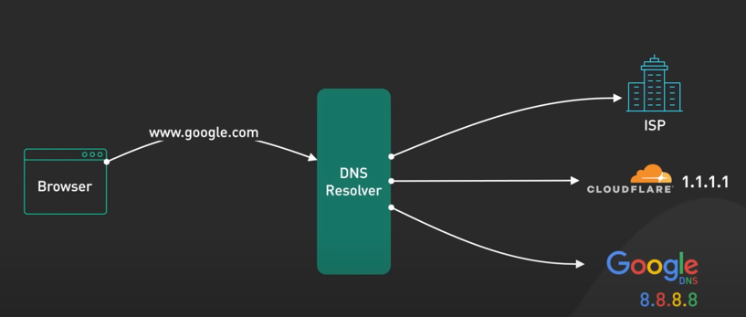

# DNS Server Notes

## Overview
- **DNS (Domain Name System)**: Backbone of the internet.
- Translates human-readable domain names (e.g., google.com) to machine-readable IP addresses.
- 

## DNS Hierarchy

1. **DNS Resolver**:
   - Initial point of contact for DNS queries.
   - Provided by ISPs or popular DNS providers (e.g., Cloudflare’s 1.1.1.1, Google’s 8.8.8.8).
   - If answer not in cache, queries the authoritative nameserver.

   

2. **Authoritative Nameserver**:
   - Holds the DNS records for a domain.
   - Updated when domain’s DNS records change.

3. **DNS Server Levels**:
   - **Root Name Servers**:
     - Store IP addresses of TLD name servers.
     - 13 logical root name servers, each with a single IP address.
     - 
     - Physical servers behind each IP address use anycast routing.
   - **TLD (Top-Level Domain) Name Servers**:
     - Store IP addresses of authoritative name servers for domains under them.
     - Examples: .com, .org, .edu, country codes like .de, .uk.
   - **Authoritative Name Servers**:
     - Provide authoritative answers to DNS queries.
     - 

## DNS Query Process
1. User types a domain name (e.g., google.com) in the browser.
2. **Browser**:
   - Checks its cache.
   - If no answer, makes an OS call.
3. **Operating System**:
   - Checks its cache.
   - If no answer, contacts the DNS resolver.
4. **DNS Resolver**:
   - Checks its cache.
   - If no answer or expired, asks the root name server.
5. **Root Name Server**:
   - Responds with list of .com TLD name servers.
6. **DNS Resolver**:
   - Contacts .com TLD name server.
   - TLD name server returns authoritative name servers for the domain.
7. **DNS Resolver**:
   - Contacts the domain’s authoritative name server.
   - Returns IP address of the domain to the OS.
8. **Operating System**:
   - Returns IP address to the browser.

## DNS Record Updates
- **DNS Propagation**: Slow due to TTL (Time-To-Live) on each DNS record.
- **Challenges**:
  - Some DNS resolvers do not honor TTL.
- **Mitigation Steps**:
  1. **Reduce TTL**: Set a short TTL (e.g., 60 seconds) well before making updates.
  2. **Keep Old Server Running**: Maintain the old IP address server for a while to allow all resolvers to update.

## Conclusion
- DNS is decentralized and robust due to its hierarchical design.
- It is a critical component of the internet, translating domain names to IP addresses.

***

# OSI Model Notes

## Overview
- **OSI Model**: Open Systems Interconnect model, a theoretical framework for understanding network communication.
- Divides communication between two devices into seven abstraction layers.
- 

## Layers of the OSI Model

### 1. Physical Layer
- **Function**: Transmits raw bits of data across a physical connection.
- 

### 2. Data Link Layer
- **Function**: Takes raw bits from the physical layer and organizes them into frames.
- **Ensures**: Frames are delivered to the correct destination.
- **Example**: Ethernet.
- 

### 3. Network Layer
- **Function**: Routes data frames across different networks.
- **Example**: IP part of TCP/IP.
- 

### 4. Transport Layer
- **Function**: Handles end-to-end communication between two nodes at port level
- **Protocols**: TCP and UDP.
- 

#### TCP (Transmission Control Protocol)
- **Provides**: Reliable, end-to-end communication.
- **Method**: Divides data into segments, each with a sequence number.
- **Ensures**: Data reassembly in correct order, error checking for data integrity.
- - 
- - 
  - 

#### UDP (User Datagram Protocol)
- **Provides**: Simpler and faster communication.
- **Method**: Sends packets without ensuring order or integrity.
- **Responsibility**: Receiving end checks for errors and discards corrupted packets.
- 
- 

### 5. Session Layer
- Manages sessions between applications.
- Often collapsed with presentation and application layers in practice.

### 6. Presentation Layer
- Translates data between the application and the network format.
- Ensures data is in a usable format.

### 7. Application Layer
- **Function**: Provides network services to applications.
- **Example**: HTTP.
- 

## Data Transmission Example
1. **Application Layer**: Adds HTTP header to data.
2. **Transport Layer**: Encapsulates data into TCP segments with source port, destination port, and sequence number.
- 
3. **Network Layer**: Adds IP header with source and destination IP addresses.
4. **Data Link Layer**: Adds MAC header with source and destination MAC addresses.
5. **Physical Layer**: Sends encapsulated frames as raw bits.
- 

### MAC Addresses
- In practice, MAC addresses are often those of routing devices in the next hop, not the final sender/receiver.

## Data Reception Process
1. **Physical Layer**: Receives raw bits.
2. **Data Link Layer**: Removes MAC header.
3. **Network Layer**: Removes IP header.
4. **Transport Layer**: Removes TCP header.
5. **Application Layer**: Processes the HTTP request.
- 

## Conclusion
- The OSI model is primarily educational and provides a structured way to think about networking.
- Used by networking vendors and cloud providers to describe networking products.

### Cloud Load Balancers
- **L4 Load Balancer**: Operates at the TCP level.
- **L7 Load Balancer**: Operates at the application protocol layer (e.g., HTTP or HTTPS).

***
# CDN (Content Delivery Network) Notes

## Overview
- **CDN (Content Delivery Network)**: A system of distributed servers that deliver content to a user based on their geographic location, the origin of the webpage, and the content delivery server.
- Initially developed in the late 90s to speed up the delivery of static HTML content.

## Evolution and Modern Use
- Over the decades, CDNs have evolved and should now be used whenever HTTP traffic is served.
- A modern CDN significantly improves web service performance, user engagement, and retention.

## Fundamental Function
- **Content Proximity**: A CDN brings content closer to the user by deploying servers at multiple locations worldwide, known as Points of Presence (PoPs).
- **Edge Servers**: Servers inside PoPs, called edge servers, ensure users can reach a fast server nearby.
- 
## Traffic Routing
- 
- **DNS-Based Routing**:
  - Each PoP has its own IP address.
  - DNS returns the IP address of the PoP closest to the user.
  - 
- **Anycast**:
  - All PoPs share the same IP address.
  - The network directs the request to the PoP closest to the requester.
  - 

## Content Caching
- **Reverse Proxy and Cache**:
  - Edge servers act as reverse proxies with extensive content caches.
  - Static content is cached on the edge server, allowing quick delivery to users.
  - Reduces the load and bandwidth requirements of the origin server.
  - 
  - 

## Content Optimization
- **On-the-Fly Transformation**:
  - CDNs can optimize static content, such as minifying JavaScript or converting images to modern formats like WebP or AVIF.
  - 

## TLS Termination
- **TLS Connections**:
  - TLS connections terminate at the edge server, reducing latency for establishing encrypted TCP connections.
  - TLS handshakes are network-expensive; terminating at the edge server minimizes this.
  - 

## Security
- **DDoS Protection**:
  - CDNs have large network capacities at the edge, providing effective DDoS protection by diffusing attack traffic over numerous servers.
  - Especially effective with CDNs built on Anycast networks.
  - 
  - 

## Availability
- **High Availability**:
  - CDNs are highly distributed with content copies available in multiple PoPs.
  - They can withstand more hardware failures than origin servers.

## Conclusion
- **Benefits**: Modern CDNs improve performance, security, and availability.
- **Recommendation**: Use CDNs for serving HTTP traffic to leverage these benefits.

***

# HTTP Evolution Notes

## Overview
- **HTTP (Hypertext Transfer Protocol)**: Protocol for transmitting hypermedia documents.
- Evolved over the years from HTTP/1 to HTTP/3.

## HTTP Versions Progression
- **HTTP/1**: Introduced in 1996, built on top of TCP.
  - Separate TCP connection for every request to the same server.
- **HTTP/1.1**: Released in 1997.
  - Introduced keep-alive mechanism: reuse connection for multiple requests.
  - Reduced request latency by avoiding the TCP three-way handshake for every request.
  - Added HTTP pipelining: send multiple requests before waiting for each response.
  -    
  - 

  - **Issues**:
    - Head of line blocking: subsequent requests must wait for previous ones to complete.
    - 
    - Many proxy servers did not handle pipelining properly.
    - Support for pipelining was eventually removed from many browsers.
    - Browsers kept multiple TCP connections to the same server to maintain performance.
- **HTTP/2**: Published in 2015.
  - Introduced HTTP streams: multiple request streams on a single TCP connection.
  - Streams are independent, no order required for sending/receiving.
  - Solved head of line blocking at the application layer, but not at the transport layer (TCP).
  - 
  - Introduced push capability: servers can send updates without client polling.
  - 
- **HTTP/3**: Draft began in 2020, published in June 2022.
  - Uses QUIC protocol instead of TCP.
  - QUIC is based on UDP, with streams as first-class citizens at the transport layer.
  - 

  - Streams share the same QUIC connection, no additional handshakes for new ones.
  - Eliminates head of line blocking at the transport layer.
  - Designed for mobile-heavy internet usage, supports quick and reliable network transitions.
  - Connection ID concept allows smooth handoff between IP addresses and network interfaces.
  - - 

  - Widely adopted: used by 25% of websites and supported by many browsers.

## Summary
- HTTP has evolved significantly to address issues like head of line blocking and latency.
- The latest version, HTTP/3, with QUIC protocol, provides efficient performance, especially for mobile usage.

***

## GRPC Notes

## Overview
- **gRPC**: Open-source remote procedure call framework developed by Google in 2016.
- Rewritten from Google's internal RPC infrastructure, enabling efficient inter-machine communication.

## Key Features and Benefits
- **Developer Ecosystem**: Thriving community for developing scalable, type-safe APIs.
- 

- **Protocol Buffers**: Language-agnostic data interchange format used by gRPC for efficient encoding.
-  
- **Multi-Language Support**: Generates client and server code in various languages from proto files.
]         
## Performance
- **Efficiency**: Protocol Buffers provide fast binary encoding superior to JSON.
- **HTTP/2 Foundation**: Supports multiple streams over a single TCP connection for high concurrency.

  

## Implementation
- **Client-Server Interaction**: Example of Order Service (client) calling Payment Service (server).
- **Data Flow**: Encodes data into Protocol Buffers, sends via HTTP/2 as data frames for high-speed transmission.

## Limitations and Usage
- **Browser Limitations**: Current lack of full browser support for direct gRPC calls.
- **gRPC-Web**: Proxy-based solution for browser support, but with limited feature set and adoption.

## Use Cases
- **Microservices**: Preferred communication mechanism between services in data centers.
- **Mobile Clients**: Efficient for native mobile applications due to performance and bandwidth advantages.

---

For further details on gRPC and its implementation, refer to the provided resources and links.

